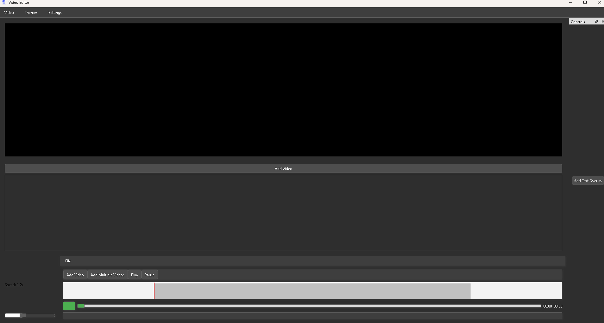
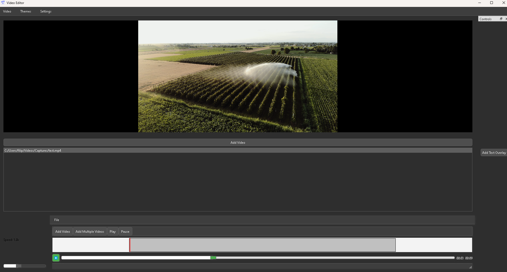

# Video Editor - C++ Project

## Overview
This project is a video editor application built using Qt. It provides various features for video editing, including applying filters, adding overlays, cutting and combining videos, and more.

## Features

- **Modern UI**: The application uses a modern style with support for multiple themes.
- **Video Playback**: Play, pause, and seek through videos.
- **Video Editing**:
   - Cut video segments.
   - Combine multiple videos.
   - Add text overlays.
   - Add image overlays.
   - Apply various filters (e.g., Grayscale, Sepia, Invert).
- **File Handling**: Import and manage video files.
- **FFmpeg Integration**: Utilize FFmpeg for video processing tasks.
- 
## Usage

1. Run the application:
    ```sh
    ./VideoEditorApp
    ```

## Photo Gallery

</img>
</img>

## Dependencies

- Qt 5.15 or later
- FFmpeg

## Future Features

As development progresses, new options and functionalities will be added to enhance the video editor and meet user needs. These will be implemented after completing and testing the basic features.

## System Requirements

- C++ Compiler (e.g., GCC, Clang, MSVC)
- FFmpeg library for video file handling
- Qt library for the graphical user interface (GUI)
- Operating System: Windows, macOS, or Linux

## Contributing

1. Fork the repository.
2. Create a new branch (`git checkout -b feature-branch`).
3. Make your changes.
4. Commit your changes (`git commit -am 'Add new feature'`).
5. Push to the branch (`git push origin feature-branch`).
6. Create a new Pull Request.

## Installation

1. Clone the repository:
    ```sh
    git clone https://github.com/yourusername/video-editor-app.git
    ```
2. Navigate to the project directory:
    ```sh
    cd video-editor-app
    ```
3. Build the project using CMake:
    ```sh
    mkdir build
    cd build
    cmake ..
    make
    ```

## License

This project is licensed under the MIT License.